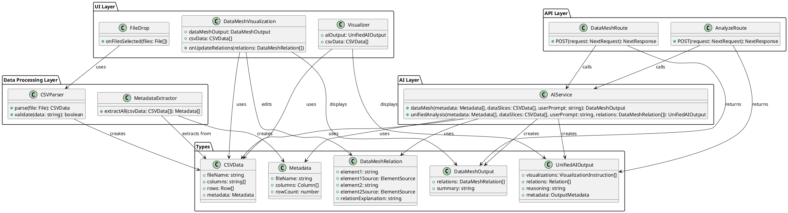

# Revellio

Revellio ist ein KI-gestütztes Analyse- und Visualisierungstool mit Fokus auf Erkenntnisgewinn. Der User liefert Daten, das System übernimmt Analyse, Strukturierung und Darstellung.

## Workflow

Revellio verwendet einen zweistufigen KI-Workflow:

1. **Data Mesh Analyse**: KI erkennt Relationen zwischen Daten (20 Datenpunkte pro Datei)
2. **User-Bearbeitung**: User kann Relationen überprüfen und bearbeiten
3. **Visualisierungsanalyse**: KI erstellt Visualisierungsstrategie basierend auf bearbeiteten Relationen
4. **Visualisierungen**: Dynamische Visualisierungen werden angezeigt

A modern Next.js application built with TypeScript, Tailwind CSS, and shadcn/ui.

## Prerequisites

- Node.js 18.0.0 or higher
- pnpm 8.0.0 or higher

## Getting Started

### Installation

1. Clone the repository:
```bash
git clone <repository-url>
cd revellio
```

2. Install pnpm (if not already installed):
```bash
npm install -g pnpm
```

3. Install dependencies:
```bash
pnpm install
```

4. Set up environment variables:
```bash
# Create .env.local file
echo "OPENAI_API_KEY=your-api-key-here" > .env.local
```

**Important**: You must set the `OPENAI_API_KEY` environment variable for the AI features to work. In production (Vercel), add this in your project settings under Environment Variables.

5. Run the development server:
```bash
pnpm dev
```

Open [http://localhost:3000](http://localhost:3000) with your browser to see the result.

## Available Scripts

- `pnpm dev` - Start the development server
- `pnpm build` - Build the application for production
- `pnpm start` - Start the production server
- `pnpm lint` - Run ESLint

## Tech Stack

- **Framework:** [Next.js](https://nextjs.org) 16 with App Router
- **Language:** TypeScript
- **Styling:** Tailwind CSS v4
- **UI Components:** [shadcn/ui](https://ui.shadcn.com)
- **AI:** OpenAI GPT-4o
- **Logging:** Pino
- **Package Manager:** pnpm

## Project Structure

```
revellio/
├── app/                    # Next.js app directory
│   ├── api/               # API routes
│   │   └── ai/            # AI endpoints
│   │       ├── data-mesh/ # Data mesh analysis
│   │       └── analyze/   # Visualization analysis
│   └── page.tsx           # Main application page
├── components/             # React UI components
│   ├── data-mesh-visualization/  # Data mesh visualization
│   ├── visualizations/     # Dynamic visualization components
│   ├── file-drop.tsx      # File upload component
│   ├── file-display.tsx   # File data display
│   └── visualizer.tsx    # Main visualizer component
├── lib/                   # Core functionality
│   ├── logger.ts          # Logging utility (Pino)
│   ├── utils.ts           # General utilities
│   ├── data/              # Data processing
│   │   └── csv-parser.ts
│   ├── analysis/          # Analysis logic (deterministic)
│   │   └── metadata-extractor.ts
│   ├── ai/                # AI integration
│   │   └── ai-service.ts  # AI service (dataMesh, unifiedAnalysis)
│   └── types/             # TypeScript types
│       └── data.ts
├── docs/                  # Documentation
│   ├── workflow.md        # Workflow documentation
│   ├── data-mesh-component.md
│   └── class-diagram.puml
├── public/                # Static assets
│   └── examples/          # Sample CSV files
└── Project-Spec.md        # Project specification
```

## Architecture

### Workflow Overview

Revellio follows a two-step AI-driven workflow:

1. **Data Mesh Analysis**: AI detects relationships between data elements (using 20 data points per file)
2. **User Review**: User can view, edit, and refine detected relations
3. **Visualization Analysis**: AI creates visualization strategy based on edited relations
4. **Visualization Display**: Dynamic visualizations are rendered based on AI recommendations

See [Workflow Documentation](./docs/workflow.md) for detailed information.

### Class Diagram



### Architecture Overview

Die Architektur folgt dem Prinzip der klaren Trennung zwischen KI und deterministischer Logik:

- **UI Layer** (`/components/`): Präsentationslogik, interaktive Komponenten
- **Data Processing Layer** (`/lib/data/`): CSV-Parsing, Validierung
- **Analysis Layer** (`/lib/analysis/`): Deterministische Analyse (Metadaten-Extraktion)
- **AI Layer** (`/lib/ai/`): KI-gestützte Analyse (Data Mesh & Visualisierungen)
- **API Layer** (`/app/api/`): REST API Endpoints für AI-Services
- **Types** (`/lib/types/`): TypeScript-Typdefinitionen

Die KI übernimmt strategische Entscheidungen (Relationen, Visualisierungen), während die deterministische Logik die eigentliche Datenverarbeitung und das Rendering übernimmt.

## MVP Workflow

Revellio follows a two-step AI-driven workflow that ensures users have control over relationship detection before visualization generation.

### Step-by-Step Process

```
1. User Uploads Data
   ↓
2. Data Mesh Analysis (AI Step 1)
   - AI analyzes 20 data points per file
   - Detects relationships and connections
   - Returns Data Mesh with relations
   ↓
3. User Reviews & Edits Relations
   - User can view all detected relations
   - User can edit relation explanations
   - User can remove unwanted relations
   - User can modify connection points
   ↓
4. Visualization Analysis (AI Step 2)
   - Edited relations passed to second AI run
   - AI determines best visualization methods
   - AI creates visualization strategy based on relations
   ↓
5. Visualizations Displayed
   - Dynamic visualizations rendered
   - Based on AI recommendations
   - Leveraging the defined relations
```

### Why Two Steps?

1. **User Control**: Users can review and refine relations before visualization
2. **Better Results**: Visualizations are based on verified relations
3. **Transparency**: Users understand what relationships drive visualizations
4. **Efficiency**: Relations are determined once, then reused

For detailed workflow documentation, see [docs/workflow.md](./docs/workflow.md).

## Projekt-Spezifikation

Version 0.1 – Arbeits- & Entscheidungsbasis

### Zweck und Einordnung des Dokuments

Dieses Dokument dient als interne Referenz für das Projekt Revellio. Es hält die zentralen Annahmen, Definitionen und Leitplanken fest und soll ein gemeinsames, konsistentes Verständnis des Produkts ermöglichen. Es bildet die Grundlage für Produktentscheidungen, konzeptionelle Weiterentwicklung und spätere technische Umsetzung.

Das Dokument ist bewusst nicht für externe Kommunikation gedacht. Es ist kein Marketingtext, kein Pitch-Deck, keine technische Spezifikation und kein Businessplan. Der Fokus liegt auf Klarheit, Nachvollziehbarkeit und Entscheidungsfähigkeit.

### Ausgangslage und Problemverständnis

#### Ursprung der Idee

Die Idee zu Revellio entstand aus der Beobachtung, dass strukturierte Daten zwar weit verbreitet sind, deren sinnvolle Auswertung jedoch weiterhin anspruchsvoll bleibt. CSV-Dateien sind ein gängiges Austauschformat, werden jedoch oft nur oberflächlich genutzt oder gar nicht analysiert.

#### Kernprobleme im Umgang mit Daten

- Daten liegen fragmentiert in mehreren Dateien vor
- Zusammenhänge zwischen Datensätzen sind unklar
- Nutzer wissen nicht, welche Fragen sie stellen sollen
- Visualisierungstools setzen Analysewissen voraus

#### Grenzen bestehender Lösungen

Bestehende Tools bieten leistungsfähige Funktionen, verlangen jedoch:

- manuelle Modellierung
- Kenntnisse über Datenstrukturen
- Entscheidungen über Visualisierungen
- Vorwissen über relevante Zusammenhänge

Revellio setzt an dem Punkt an, an dem dieses Wissen fehlt.

### Produktdefinition und Leitgedanken

#### Was Revellio ist

Revellio ist ein KI-gestütztes Analyse- und Visualisierungstool mit Fokus auf Erkenntnisgewinn. Der User liefert Daten, das System übernimmt Analyse, Strukturierung und Darstellung.

#### Zentrale Eigenschaften

- Automatisches Erkennen von Zusammenhängen
- Mehrere Homogene Inputs sollen zusammengebracht werden können
- Heterogene Inputs Interpretieren und Annahmen für Zusammenführung ausarbeiten
- KI-gesteuerte Struktur- und Visualisierungsentscheidungen
- erklärende Einordnung aller relevanten Ergebnisse
- geführte Nutzererfahrung

#### Was Revellio nicht ist

- kein klassisches BI-Tool
- kein Dashboard-Builder
- kein Excel-Ersatz
- kein Tool zur Bestätigung bestehender Annahmen

#### Leitprinzipien

- Erkenntnis vor Kontrolle
- Führung statt Konfiguration
- Transparenz statt Blackbox
- Einfachheit im MVP, Erweiterbarkeit im Konzept

#### Namensgebung und visuelle Leitidee

Der Name Revellio steht für das Offenlegen, Verstehen und Sichtbarmachen von verborgenen Strukturen in Daten. Er ist bewusst nicht rein beschreibend, sondern als Kunstwort gewählt, um Assoziationen wie Erkenntnis, Tiefe und Analyse zu vermitteln, ohne sich auf konkrete Technologien oder Features festzulegen. Dadurch bleibt der Name zeitlos und erweiterbar.

Für die visuelle Identität, insbesondere das Logo, soll dieser Charakter aufgegriffen werden. Zentrale Leitgedanken sind Klarheit, Struktur, Offenlegung und Präzision. Die Gestaltung soll reduziert, seriös und technisch wirken, ohne kühl oder abstrakt zu sein. Name, Produkt und visuelle Erscheinung sollen ein konsistentes Gesamtbild ergeben, das Vertrauen schafft und den Anspruch von Revellio als erklärender Analysepartner widerspiegelt.

### Zielgruppen und Nutzungskontext

#### Primäre Zielgruppen

Personen mit begrenzter Datenkompetenz, die dennoch aus Daten Erkenntnisse gewinnen möchten, zum Beispiel:

- Gründerinnen und Gründer
- Projektverantwortliche
- Fachpersonen ohne Analysehintergrund
- Studierende

#### Sekundäre Zielgruppen

Datenaffine Nutzer, die Revellio als Ergänzung oder Beschleuniger nutzen:

- Analysten
- Entwickler
- Data Scientists (explorativ)

#### Erwartungshaltung

- schneller Überblick über Daten
- neue Perspektiven
- verständliche Erklärungen
- Möglichkeit zur Weiterverarbeitung

### Rolle der KI und Systemlogik

#### Aufgaben der KI

Die KI übernimmt die inhaltliche Analyse und strategische Entscheidungsfindung:

- Analyse von Metadaten und Stichproben
- Erkennen semantischer Überschneidungen
- Identifikation möglicher Relationen
- Ableitung sinnvoller Datenstrukturen
- Auswahl geeigneter Visualisierungsformen

#### Die KI übernimmt nicht:

- vollständige Datenverarbeitung
- Aggregation grosser Datenmengen
- Rendering von Visualisierungen
- UI-Logik

Diese Aufgaben werden deterministisch durch klassischen Code umgesetzt.

#### Transparenzprinzip

- jede Analyse wird erklärt
- Annahmen werden offengelegt
- Entscheidungen werden begründet
- Unsicherheiten werden kommuniziert

### Dateninput und Analyseverständnis

#### Art der Daten

Im MVP verarbeitet Revellio ausschliesslich CSV-Dateien mit strukturierter Tabellendatenform.

**Umfang und Einschränkungen**

- bewusst limitierte Dateigrössen
- Fokus auf Struktur, nicht auf Masse
- Premium-Erweiterungen perspektivisch möglich

#### Analyseansatz

- Extraktion von Spalten, Datentypen und Stichproben
- keine vollständige Rohdatenanalyse im ersten Schritt
- Aufbau eines semantischen Gesamtbilds

#### Umgang mit Datenqualität

- unvollständige oder inkonsistente Daten werden toleriert
- Probleme werden transparent kommuniziert
- schlechte Datenqualität wird nicht kaschiert

### Output-, Visualisierungs- und Erklärkonzept

#### Visualisierungsprinzip

- Ergebnisse werden in UI-Blöcken dargestellt
- Auswahl der Blöcke erfolgt durch KI
- Umsetzung erfolgt statisch über Code

#### Beispiele für UI-Blöcke

- Diagramme
- Tabellen
- relationale Ansichten
- aggregierte Übersichten

#### Erklärung der Ergebnisse

Jede Darstellung wird begleitet von:

- Beschreibung der dargestellten Daten
- Erklärung der gewählten Struktur
- Begründung der Visualisierungsform

### User-Interaktion und Nutzerführung

#### Interaktion im MVP

- geführter Einstieg
- minimale Konfigurationsmöglichkeiten
- Fokus auf Verstehen statt Einstellen

#### Erweiterte Interaktion (vorgesehen)

- zusätzliches Prompting
- gezielte Nachfragen an die KI
- Kontext- und Detailabfragen

#### Langfristiges Zielbild

- intuitiv für Einsteiger
- leistungsfähig für Fortgeschrittene
- keine Überforderung durch Komplexität

### MVP-Abgrenzung und Fokus

#### Ziel des MVP

- Proof of Concept
- Validierung des Kernmechanismus
- Demonstration des Mehrwerts

#### Enthalten im MVP

- CSV-Import
- KI-Analyse von Metadaten
- automatische Visualisierung
- erklärende Texte
- Speicherung des Analysezustands
- visuelle Exporte

#### Nicht enthalten im MVP

- Slides und Storytelling
- umfangreiche Konfiguration
- komplexe Filterlogiken
- grosse Datenmengen

### Persistenz und Weiterverarbeitung

#### Speicherung

Revellio speichert:

- Analysezustand
- erkannte Strukturen
- Visualisierungsentscheidungen

Ziel ist Reproduzierbarkeit und Weiterführung von Analysen.

#### Exportmöglichkeiten

- Export von Visualisierungen (z. B. PNG, PDF)
- perspektivisch Export strukturierter Daten

### Technische Leitplanken

#### Architekturprinzipien

- klare Trennung zwischen KI und Ausführung
- Modularität
- Erweiterbarkeit
- Wartbarkeit

#### Skalierbarkeit

- kein primäres MVP-Ziel
- jedoch konzeptionell vorbereitet
- Erweiterungen ohne Neudenken des Kerns

### Projektstatus und Ausblick

#### Einordnung

Revellio ist aktuell ein Side-Project mit Startup-Potenzial. Der Fokus liegt auf Lernen, Validierung und konzeptioneller Schärfung.

#### Offene Punkte

- langfristige Positionierung
- Geschäftsmodell
- Markteintritt

#### Nächste Schritte

- Weitere Schärfung des MVP
- technische Prototypen
- Tests mit realen Datensätzen

### Glossar

| Begriff | Erklärung |
|---------|-----------|
| **CSV-Datei** | Comma-Separated Values. Ein textbasiertes Dateiformat zur Speicherung tabellarischer Daten, bei dem jede Zeile einen Datensatz und jede Spalte ein Datenfeld darstellt. |
| **Strukturierte Daten** | Daten, die in einem festen Schema vorliegen, typischerweise in Tabellenform mit klar definierten Spalten und Datentypen. |
| **Homogener Input** | Mehrere Datensätze mit vergleichbarem strukturellem Aufbau und gemeinsamem inhaltlichem Kontext, die sich sinnvoll gemeinsam analysieren oder zusammenführen lassen. |
| **Heterogener Input** | Datensätze mit unterschiedlichem Aufbau oder unterschiedlichem inhaltlichen Kontext, deren Zusammenführung zusätzliche Interpretation oder Annahmen erfordert. |
| **Metadaten** | Daten über Daten, beispielsweise Spaltennamen, Datentypen oder Formatierungen, die Informationen über die Struktur der eigentlichen Daten liefern. |
| **Stichprobe** | Eine begrenzte Auswahl von Datensätzen aus einer grösseren Datenmenge, die zur Einschätzung der Datenstruktur und Inhalte verwendet wird. |
| **Semantische Überschneidung** | Inhaltliche Gemeinsamkeit zwischen Datenfeldern oder Datensätzen, auch wenn diese unterschiedlich benannt oder strukturiert sind. |
| **Relation** | Eine logische oder inhaltliche Beziehung zwischen Datensätzen oder Spalten, zum Beispiel über gemeinsame Schlüssel, Zeitbezüge oder Kategorien. |
| **Aggregation** | Zusammenfassung von Daten durch Rechenoperationen wie Zählen, Summieren oder Mittelwertbildung, um übergeordnete Muster sichtbar zu machen. |
| **KI (Künstliche Intelligenz)** | Analytische und strategische Systemkomponente in Revellio, die Daten interpretiert, Zusammenhänge erkennt und Struktur- sowie Darstellungsentscheidungen vorbereitet. |
| **KI-Analyse** | Prozess, bei dem die KI Metadaten und Stichproben auswertet, um Muster, Relationen und sinnvolle Visualisierungen abzuleiten. |
| **Deterministische Logik** | Klassische Programmierlogik mit eindeutigem Verhalten, bei der identische Eingaben stets zu identischen Ausgaben führen. |
| **Datenpipeline** | Abfolge automatisierter Verarbeitungsschritte, durch die Daten transformiert, aggregiert oder weitergeleitet werden. |
| **Rendering** | Technische Umsetzung und Darstellung von Daten in visueller Form, etwa als Diagramm oder Tabelle. |
| **UI (User Interface)** | Die visuelle Benutzeroberfläche, über die der User mit dem System interagiert. |
| **UI-Block** | In sich geschlossener visueller Baustein der Benutzeroberfläche, zum Beispiel ein Diagramm, eine Tabelle oder eine relationale Ansicht. |
| **Visualisierung** | Grafische Darstellung von Daten zur besseren Erkennung von Mustern, Trends und Zusammenhängen. |
| **Analysezustand** | Der gespeicherte Gesamtzustand einer Analyse, inklusive Datenreferenzen, erkannter Strukturen und gewählter Visualisierungen. |
| **Persistenz** | Fähigkeit eines Systems, Daten oder Zustände dauerhaft zu speichern und später wiederherzustellen. |
| **Export** | Ausgeben von Analyseergebnissen oder Visualisierungen in ein externes Format, zum Beispiel als Bild oder PDF. |
| **Proof of Concept** | Frühe Produktversion, die dazu dient, die grundsätzliche Funktionsfähigkeit und den Mehrwert einer Idee zu demonstrieren. |
| **MVP (Minimum Viable Product)** | Kleinste funktionsfähige Produktversion, die den Kernnutzen abbildet und zur Validierung der Grundidee dient. |
| **Workflow-Optimierung** | Verbesserung von Arbeitsabläufen durch Reduktion manueller Schritte, Zeitaufwand oder Komplexität. |
| **Blackbox** | System, dessen interne Entscheidungsprozesse für den User nicht nachvollziehbar sind. |
| **Transparenzprinzip** | Grundsatz, nach dem Annahmen, Entscheidungen und Methodiken offen kommuniziert und erklärbar gemacht werden. |

## Learn More

To learn more about the technologies used in this project:

- [Next.js Documentation](https://nextjs.org/docs)
- [Tailwind CSS Documentation](https://tailwindcss.com/docs)
- [shadcn/ui Documentation](https://ui.shadcn.com)
- [pnpm Documentation](https://pnpm.io)

## Deploy on Vercel

The easiest way to deploy your Next.js app is to use the [Vercel Platform](https://vercel.com/new?utm_medium=default-template&filter=next.js&utm_source=create-next-app&utm_campaign=create-next-app-readme) from the creators of Next.js.

Check out the [Next.js deployment documentation](https://nextjs.org/docs/app/building-your-application/deploying) for more details.
